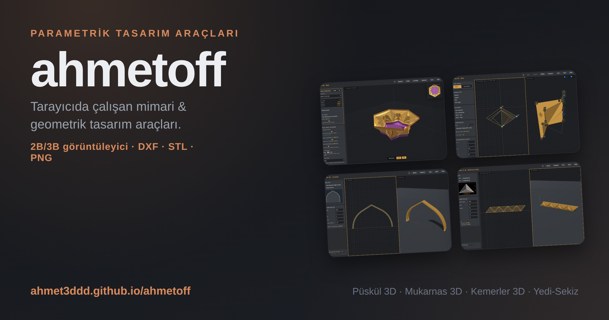
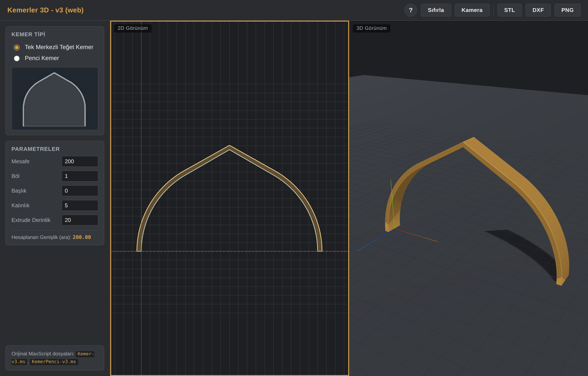
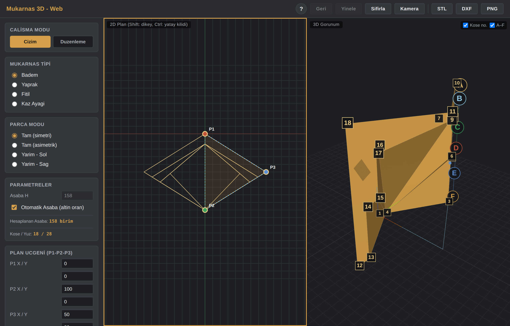
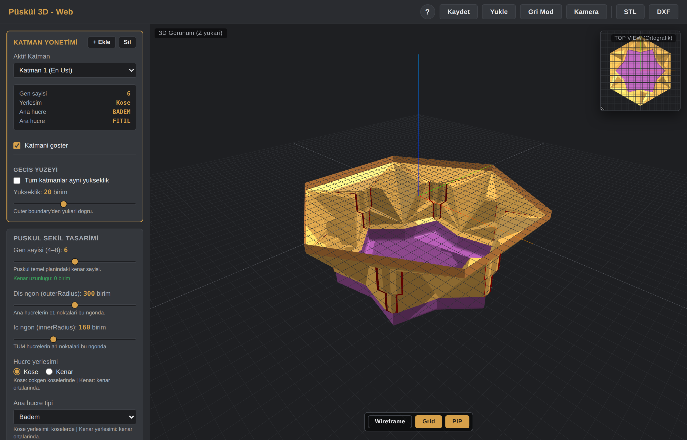
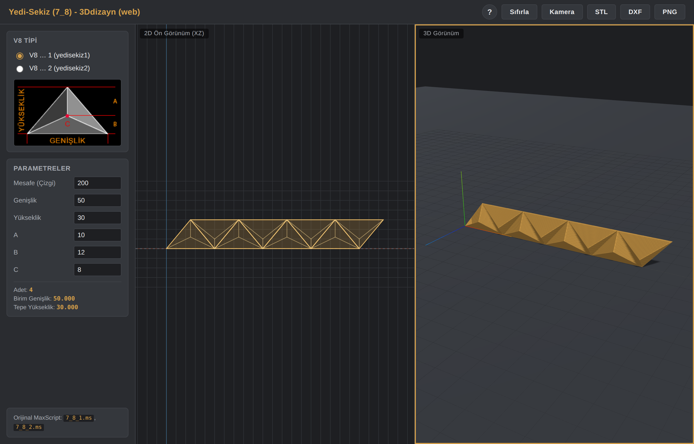

<p align="center">
  
</p>

<h1 align="center">ahmetoff</h1>

<p align="center">
  Tarayıcıda çalışan parametrik mimari ve geometrik tasarım araçları.<br/>
  Parametrelerle şekiller oluştur, 2B/3B önizle, <strong>DXF · STL · PNG</strong> olarak dışa aktar.
</p>

<p align="center">
  <a href="https://ahmet3ddd.github.io/ahmetoff/"></a>
  
  
</p>

<p align="center">
  <strong>▶ Canlı site: https://ahmet3ddd.github.io/ahmetoff/</strong>
</p>

---

## Projeler

### Kemerler 3D
Farklı kemer tiplerini (Tek Merkezli Teğet, Penci) parametrelerle 3B modeller; DXF, STL ve PNG olarak dışa aktarır.



[▶ Aç](https://ahmet3ddd.github.io/ahmetoff/projects/AI_Kemer/) · [Kaynak](projects/AI_Kemer)

### Mukarnas 3D
Mukarnas (sarkıt tavan süslemesi) tiplerini — Badem, Yaprak, Fitil, Kaz Ayağı — parametrik olarak 3B modeller. Çizim ve düzenleme modları, dışa aktarım desteği.



[▶ Aç](https://ahmet3ddd.github.io/ahmetoff/projects/AI_muk3d/) · [Kaynak](projects/AI_muk3d)

### Püskül 3D
Mukarnas püskül (sarkıt) yapılarını çok katmanlı olarak parametrik 3B modeller. Katman yönetimi, hücre tipi atama (Badem, Yaprak, Fitil, Kaz Ayağı), geçiş yüzeyleri ve JSON kaydet/yükle desteği.



[▶ Aç](https://ahmet3ddd.github.io/ahmetoff/projects/AI_Puskul/) · [Kaynak](projects/AI_Puskul)

### Yedi-Sekiz (7-8)
Geleneksel yedi-sekiz geçme desenlerini V8 tipi parametrelerle oluşturur; 2B ön görünüm ve 3B model üretir.



[▶ Aç](https://ahmet3ddd.github.io/ahmetoff/projects/AI_7-8/) · [Kaynak](projects/AI_7-8)

---

## Yapı

```
ahmetoff/
├── index.html      → Tüm projeleri listeleyen açılış sayfası
├── assets/         → Açılış sayfası ve README görselleri
├── projects/       → Her bağımsız proje kendi klasöründe
│   ├── AI_Kemer/
│   ├── AI_muk3d/
│   ├── AI_Puskul/
│   └── AI_7-8/
└── LICENSE         → MIT
```

## Teknoloji

Tüm araçlar saf HTML/CSS/JavaScript ile yazılmıştır ve 3B görselleştirme için [Three.js](https://threejs.org) kullanır. Kurulum gerekmez — tarayıcıda doğrudan çalışır.

## Yerelde çalıştırma

Projeler CDN üzerinden Three.js yükler, bu yüzden internet bağlantısı gerekir. Bir projeyi yerelde açmak için ilgili klasördeki `index.html` dosyasını tarayıcında açman yeterlidir.

## Lisans

Bu depodaki içerik [MIT](LICENSE) lisansı ile sunulmuştur.
