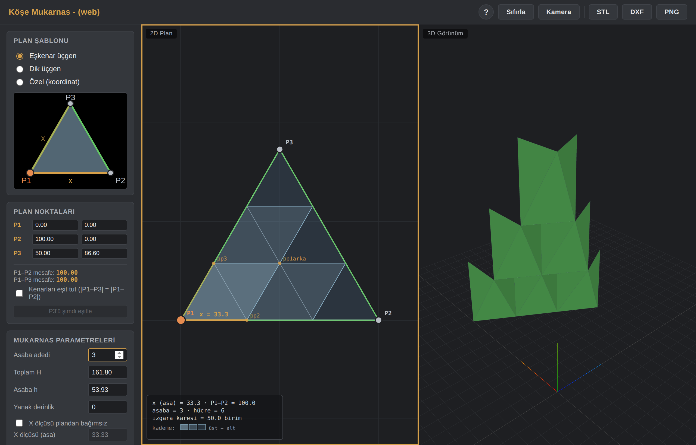
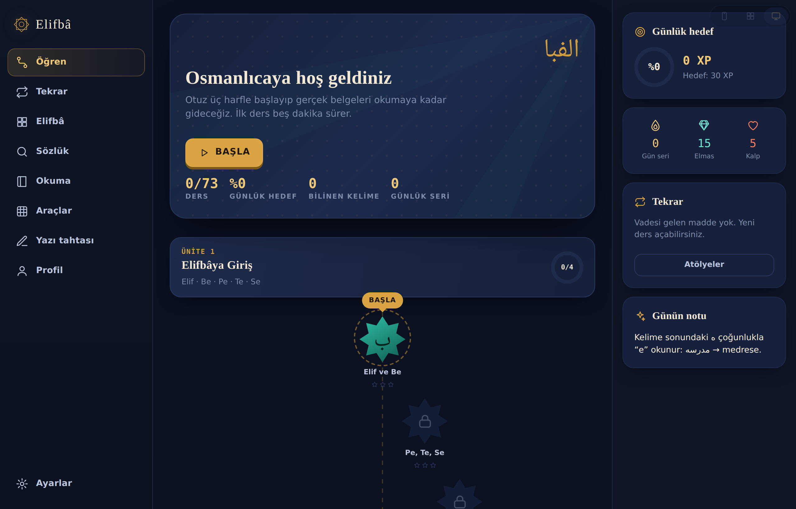

<p align="center">
  
</p>

<h1 align="center">ahmetoff</h1>

<p align="center">
  Tarayıcıda çalışan, kurulum gerektirmeyen açık kaynak projeler.<br/>
  Geleneksel mimari geometriyi modelleyen <strong>parametrik tasarım araçları</strong> ve
  Osmanlı Türkçesini sıfırdan öğreten <strong>Elifbâ</strong> uygulaması.
</p>

<p align="center">
  <a href="https://ahmet3ddd.github.io/ahmetoff/"></a>
  
  
</p>

<p align="center">
  <strong>▶ Canlı site: https://ahmet3ddd.github.io/ahmetoff/</strong>
</p>

---

## Tasarım Araçları

Geleneksel mimari geometriyi parametrelerle modelleyen araçlar. 2B plan ve 3B görünüm eş zamanlı çalışır; sonuç **DXF**, **STL** veya **PNG** olarak dışa aktarılır. Üçüncü taraf bağımlılık yalnızca [Three.js](https://threejs.org).

### Kemerler 3D
Farklı kemer tiplerini (Tek Merkezli Teğet, Penci) parametrelerle 3B modeller.


[▶ Aç](https://ahmet3ddd.github.io/ahmetoff/projects/AI_Kemer/) · [Kaynak](projects/AI_Kemer)

### Mukarnas 3D
Mukarnas (sarkıt tavan süslemesi) tiplerini — Badem, Yaprak, Fitil, Kaz Ayağı — parametrik olarak 3B modeller. Çizim ve düzenleme modları.


[▶ Aç](https://ahmet3ddd.github.io/ahmetoff/projects/AI_muk3d/) · [Kaynak](projects/AI_muk3d)

### Köşe Mukarnas
Köşe mukarnaslarını üçgen plan (P1-P2-P3) üzerinden kurgular. Eşkenar/dik üçgen veya özel koordinat şablonu, asaba sayısı ve kademelerle 3B form üretir.



[▶ Aç](https://ahmet3ddd.github.io/ahmetoff/projects/AI_K_muk3d/) · [Kaynak](projects/AI_K_muk3d)

### Püskül 3D
Mukarnas püskül (sarkıt) yapılarını çok katmanlı olarak modeller. Katman yönetimi, hücre tipi atama, geçiş yüzeyleri ve JSON kaydet/yükle.


[▶ Aç](https://ahmet3ddd.github.io/ahmetoff/projects/AI_Puskul/) · [Kaynak](projects/AI_Puskul)

### Yedi-Sekiz (7-8)
Geleneksel yedi-sekiz geçme desenlerini V8 tipi parametrelerle oluşturur.


[▶ Aç](https://ahmet3ddd.github.io/ahmetoff/projects/AI_7-8/) · [Kaynak](projects/AI_7-8)

---

## Öğrenme

### Elifbâ — Osmanlıca Öğren
Osmanlı Türkçesini sıfırdan öğreten uygulama. Elifbânın 33 harfinden başlar, gerçek belge ve divan şiiri okumaya kadar gider.

**17 ünite, 73 ders, 13 alıştırma tipi.** Aralıklı tekrar (SRS) sistemi, telaffuz alıştırması, yazı tahtası ve sözlük içerir. Yazı tipleri dâhil her şey uygulamanın içinde — internet bağlantısı olmadan da çalışır. Arayüz telefon, tablet ve masaüstü düzenleri arasında anında geçer.



[▶ Aç](https://ahmet3ddd.github.io/ahmetoff/projects/AI_osmanlica/) · [Kaynak](projects/AI_osmanlica)

---

## Yapı

```
ahmetoff/
├── index.html      → Tüm projeleri listeleyen açılış sayfası
├── assets/         → Açılış sayfası ve README görselleri
├── projects/       → Her bağımsız proje kendi klasöründe
│   ├── AI_Kemer/       Kemerler 3D
│   ├── AI_muk3d/       Mukarnas 3D
│   ├── AI_K_muk3d/     Köşe Mukarnas
│   ├── AI_Puskul/      Püskül 3D
│   ├── AI_7-8/         Yedi-Sekiz
│   └── AI_osmanlica/   Elifbâ — Osmanlıca Öğren
└── LICENSE         → MIT
```

## Teknoloji

Tümü saf HTML/CSS/JavaScript. Tasarım araçları 3B görselleştirme için [Three.js](https://threejs.org) kullanır (CDN üzerinden, internet bağlantısı gerekir). Elifbâ ise tamamen kendi kendine yeter; hiçbir dış bağımlılığı yoktur.

Hiçbir projede sunucu tarafı yoktur — veri toplanmaz, hiçbir şey yüklenmez.

## Lisans

Bu depodaki içerik [MIT](LICENSE) lisansı ile sunulmuştur. Elifbâ uygulamasının içerdiği yazı tiplerinin kendi lisansları için `projects/AI_osmanlica/LISANSLAR.md` dosyasına bakın.
