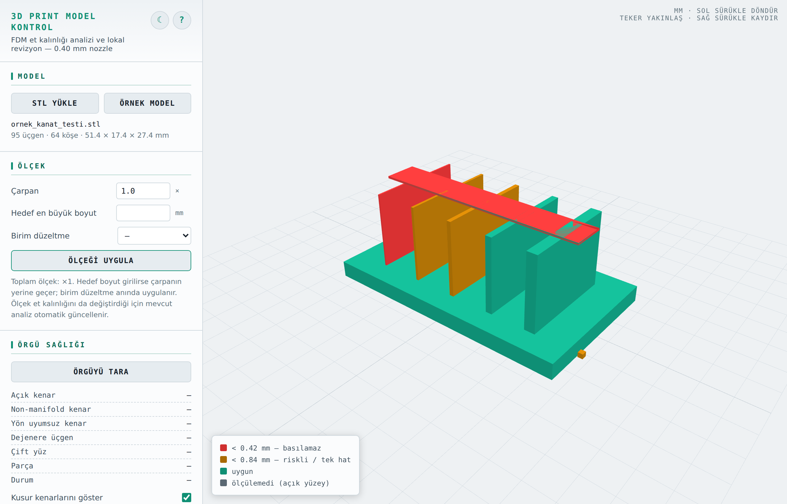

# 3D Print Model Kontrol

STL modelleri FDM baskıya göndermeden önce denetleyen, tarayıcıda çalışan bir araç: et kalınlığı analizi, örgü sağlığı taraması, onarım, ölçek/birim düzeltme ve yerel revizyon.

**▶ Canlı demo:** https://ahmet3ddd.github.io/ahmetoff/projects/AI_3Dprint_model_kontrol/

## Ne yapar

**Et kalınlığı analizi.** Yüzeyden içeri atılan ışınların karşı yüzeye mesafesi ölçülür (ray tabanlı kalınlık). Sonuç model üzerinde renklendirilir:

| Renk | Anlam |
|---|---|
| 🔴 Kırmızı | Kritik eşiğin (1 hat) altı — basılamaz |
| 🟠 Turuncu | Önerilen eşiğin (2 hat) altı — riskli / tek hat |
| 🟢 Yeşil | Uygun |
| ⚪ Gri | Ölçülemedi (açık yüzey) |

Eşikler nozzle çapı ve hat genişliğinden otomatik hesaplanır (varsayılan 0.40 mm nozzle → 0.42 / 0.84 mm); elle de girilebilir. Malzeme seçimi (PLA vb.) ve daha isabetli ölçüm için koni ışınları seçeneği vardır. Sonuç panelinde kritik/uyarı/uygun alan yüzdeleri, ölçülen en ince kalınlık ve kaçan ışın oranı raporlanır.

**Ölçek ve birim düzeltme.** STL formatı birim bilgisi taşımadığı için modeller sık sık yanlış ölçekte gelir — inç tabanlı bir CAD'den çıkan dosya 25,4 kat küçük görünür. Üç yoldan düzeltilir: doğrudan **çarpan**, **hedef en büyük boyut** (çarpanı kendisi hesaplar) veya hazır **birim dönüşümü** (inç → mm, cm → mm, m → mm). Ölçek et kalınlığını da değiştirdiği için mevcut analiz otomatik olarak yeniden hesaplanır.

**Örgü sağlığı ve onarım.** Açık kenar, non-manifold kenar, yön uyumsuz kenar, dejenere üçgen, çift yüz ve parça sayısı taranır. Tek tuşla onarım: normaller birleştirilip dışa çevrilir, dejenere/çift yüzler temizlenir, kırıntı parçalar silinir, küçük delikler kapatılır.

**Yerel revizyon.** İnce bölgeler hedef kalınlığa (örn. 2 hat) doğru kalınlaştırılır; yön (dışa/içe) ve yüzey başına azami ofset sınırlandırılabilir. Sonuç **STL olarak indirilir**; orijinale dönme seçeneği vardır.

## Kullanım

Kurulum gerekmez. `index.html` dosyasını tarayıcıda aç, STL dosyanı sürükleyip bırak (veya örnek modeli yükle). Önerilen akış: **Ölçeği doğrula → Örgüyü tara → gerekiyorsa Onar → Analiz et → gerekiyorsa Revize et → STL indir**.

Modelin boyutları yükleme sonrası panelde yazar (örn. `51.4 × 17.4 × 27.4 mm`); beklediğinden farklıysa önce ölçeği düzelt, çünkü kalınlık eşikleri milimetre üzerinden çalışır.

Dosya hiçbir yere gönderilmez; bütün işlem tarayıcının içinde, yerel olarak yapılır.

## Sınırlar

Analiz baskı yönelimine göre XY/Z ayrımı yapmaz; eşikler dikey duvar kabulüyle yorumlanmalıdır. Kendisiyle kesişme örgü taramasına dahil değildir; büyük delikler yalnızca raporlanır.

## Teknoloji

Tek HTML dosyası — saf HTML/CSS/JavaScript + [Three.js](https://threejs.org) r128 (CDN). STL okuma/yazma, örgü analizi ve onarım tamamen uygulamanın içindedir.

---

← [Tüm projeler](../../)
